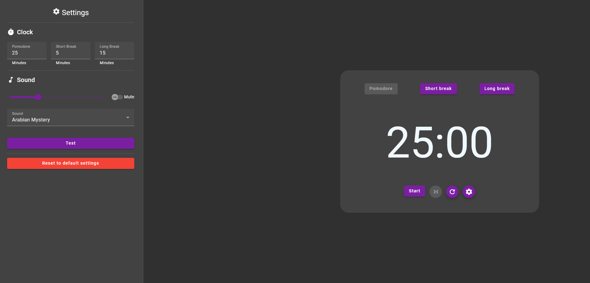

# PomodoreClock

Simple & Minimalisitc pomodoro clock application written using Angular 17 & Angular Material.

## Features

- Customization
- To Do List
- Progressive web app

## Roadmap

- [x] ~~Notifications API~~
- [ ] Theme customization
- [x] ~~To do list~~
- [ ] Responsive
- [x] ~~PWA app~~
- [ ] Tests
- [ ] Github actions

## Development server

Run `ng serve` for a dev server. Navigate to `http://localhost:4200/`. The application will automatically reload if you change any of the source files.

## Build

Run `ng build` to build the project. The build artifacts will be stored in the `dist/` directory.

## Running unit tests

Run `ng test` to execute the unit tests via [Karma](https://karma-runner.github.io).

## Running end-to-end tests

Run `ng e2e` to execute the end-to-end tests via a platform of your choice. To use this command, you need to first add a package that implements end-to-end testing capabilities.
